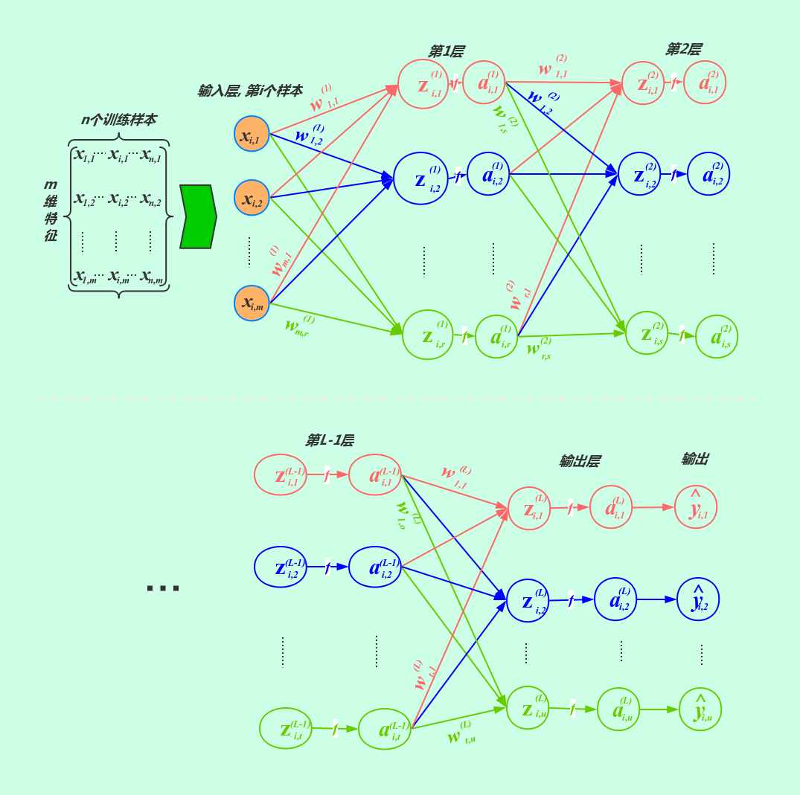
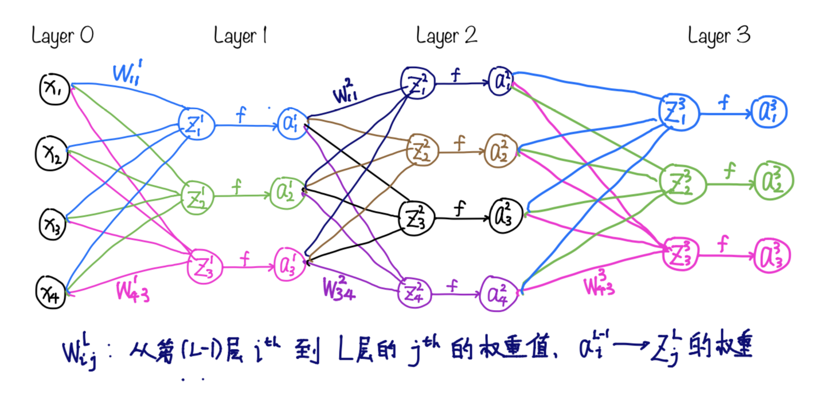

# 神经网络

[TOC]

------

## 前言

通用神经网络架构

### 符号描述

| 符号                | 维度                                                     | 描述                                                         |
| ------------------- | -------------------------------------------------------- | ------------------------------------------------------------ |
| $n$                 | $\mathbb{R}$                                             | 训练样本个数                                                 |
| $m$                 | $\mathbb{R}$                                             | 每个样本的特征个数                                           |
| $u$                 | $\mathbb{R}$                                             | 输出值个数                                                   |
| $x_{i,j}$           | $\mathbb{R}$                                             | 表示第$i^{th}$个输入样本的第$j^{th}$维特征的输入数据         |
| $x_{i}$             | $\mathbb{R}^{m \times 1}$                                | 表示第$i^{th}$个输入样本的所有m维特征向量                    |
| $X$                 | $\mathbb{R}^{m\times n}$                                 | 表示所有$n$个样本，每个样本有$m$个特征                       |
| $w_{s,t}^{(l)}$     | $\mathbb{R}$                                             | 表示从第$(l-1)^{th}$层的第$s^{th}$个神经元到第$l^{th}$层的$t^{th}$个神经元的权重； |
| $\left | l\right |$ | $\mathbb{R}$                                             | 表示第$l^{th}$层神经元个数；                                 |
| $W^{(l)}$           | $\mathbb{R}^{\left | l-1 \right |\times \left|l\right|}$ | 表示从第$(l-1)^{th}$层到$l^{th}$层映射的权重矩阵;            |
| $f$                 | $\mathbb{R} \rightarrow \mathbb{R}$                      | 激活函数                                                     |
| $z_{i,j}^{(l)}$     | $\mathbb{R}$                                             | 表示输入为第$i^{th}$个样本时，第$l^{th}$层的第$j^{th}$个神经元未激活的值，它是由第$(l-1)^{th}$层的输出经过$W^{(l)}$矩阵加权求和之后的结果。 $z_{i,j}^{(l)} = \sum_{k}^{\left|l-1\right|}a_{i,k}^{(l-1)} \cdot w_{k,j}^{(l)}$ |
| $z_{i}^{(l)}$       | $\mathbb{R}^{\left|l\right| \times 1}$                   | 表示输入为第$i^{th}$个样本时，第$l^{th}$层的$\left|l\right|$个神经元的未激活值组成的向量 |
| $Z^{(l)}$           | $\mathbb{R}^{\left|l\right|\times n}$                    | 表示$n$个样本全部输入时，第$l^{th}$层的n个样本，每个样本$\left|l\right|$个神经元未激活值组成的矩阵 |
| $a_{i,j}^{(l)}$     | $\mathbb{R}$                                             | 表示输入为第$i^{th}$个样本时，第$l^{th}$层的第$j^{th}$个神经元的输出，它是由$z_{i,j}^{(l)}$经过激活函数$f$映射而来 |
| $a_{i}^{(l)}$       | $\mathbb{R}^{\left|l\right| \times 1}$                   | 表示输入为第$i^{th}$个样本时，第$l^{th}$层的$\left|l\right|$个神经元的输出向量 |
| $A^{(l)}$           | $\mathbb{R}^{\left|l\right|\times n}$                    | 表示$n$个样本全部输入时，第$l^{th}$层的n个样本，每个样本$\left|l\right|$个神经元的输出组成的矩阵 |
| $\hat{y}_{i,j}$     | $\mathbb{R}$                                             | 表示输入为第$i^{th}$个样本时，输出层的第$j^{th}$个神经元的输出，也是整个模型的第$j^{th}$个的输出 |
| $\hat{y}_{i}$       | $\mathbb{R}^{u \times 1}$                                | 表述输入为第$i^{th}$个样本时，输出层的$u$个神经元的输出向量  |
| $\hat{Y}$           | $\mathbb{R}^{u \times n}$                                | 表示$n$个样本全部输入时，输出层的n个样本输出，每个样本$u$个输出组成的矩阵 |
| $y_{i,j}$           | $\mathbb{R}$                                             | 表示第$i^{th}$个输入样本的第$j^{th}$个实际输出值             |
| $y_i$               | $\mathbb{R}^{u \times 1}$                                | 表述第$i^{th}$个样本输出的$u$个实际输出向量                  |
| $Y$                 | $\mathbb{R}^{u \times n}$                                | 表示所有n个样本的的实际输出，每个样本$u$个实际输出组成的矩阵 |

### 常用公式

## 基本思想

正向传播时,输入样本从输入层传入,经各隐层逐层处理后,传向输出层。若输出层的实际输出与期望的输出(教师信号)不符,则转入误差的反向传播阶段。

反向传播时，将误差以某种形式通过隐层向输入层逐层反传,并将误差分摊给各层的所有单元,从而获得各层单元的误差信号,此误差信号即作为修正各单元权值的依据。

Q: 反向传播的是什么？

A: 误差，利用这些误差调整层之间的权重。

Q: 目的是什么？

A: 找到一组权重，使得整个神经网络模型的输出尽可能的接近实际值，也就是每次迭代误差越来越小。

Q: 怎么表示误差？

A: 有很多误差函数可以表示误差，取决你要用神经网络来做什么，如果是回归模型，常用的均方误差，如果是分类问题，常用的有对数损失，合页损失等。

## 损失函数和代价函数

本文针对单个样本的预测值与真实值之间的误差使用损失函数描述；对于全部n个样本的误差采用代价函数来描述。

常用的误差函数有均方误差，交叉熵损失，合页损失，对数损失等，不管具体用什么损失函数，我们定义我们的损失函数为$loss(\hat{y}_{i,j},y_{i,j})$，这里该函数可以是任何合理的损失函数，他的两个参数都为标量，它度量了预测值与实际值的差距。

第$i^{th}$个样本的损失函数：
$$
L(\hat{y}_i, y_i) =  \sum_{j=1}^u loss(\hat{y}_{i,j}, y_{i,j})
$$
代价函数为：
$$
C(\hat{Y}, Y) = \frac{1}{n} \sum_{i=1}^{n}L(\hat{y}_i, y_i) = \sum_{i=1}^n\left[ \sum_{j=1}^u loss(\hat{y}_{i,j}, y_{i,j}) \right]
$$

## 从一个例子开始

以上面的一个神经网络模型为例，剖析正向传播和反向传播的过程。

### 单样本情况

#### 正向传播

假设某个样本的输入向量和输出向量分别为：
$$
\vec{x} = \begin{bmatrix}
x_1 \\
x_2 \\
x_3 \\
x_4
\end{bmatrix}

\vec{y} = \begin{bmatrix}
y_1 \\
y_2 \\
y_3
\end{bmatrix}
$$
神经网络结构如图，Layer 1神经元个数为3，Layer 2神经元个数为4，Layer 3 为输出层，有3个输出。

##### Layer 1

第一层权重矩阵维度为$4 \times 3$：
$$
W^{(1)} = \begin{bmatrix} 
w_{1,1}^{(1)}, w_{1,2}^{(1)}, w_{1,3}^{(1)} \\
w_{2,1}^{(1)}, w_{2,2}^{(1)}, w_{2,3}^{(1)} \\
w_{3,1}^{(1)}, w_{3,2}^{(1)}, w_{3,3}^{(1)} \\
w_{4,1}^{(1)}, w_{4,2}^{(1)}, w_{4,3}^{(1)}
\end{bmatrix}
$$

$$
z_1^{(1)} = w_{1,1}^{(1)}x_1 + w_{2,1}^{(1)}x_2 + w_{3,1}^{(1)}x_3 + w_{4,1}^{(1)}x_4 \\
z_2^{(1)} = w_{1,2}^{(1)}x_1 + w_{2,2}^{(1)}x_2 + w_{3,2}^{(1)}x_3 + w_{4,2}^{(1)}x_4 \\
z_3^{(1)} = w_{1,3}^{(1)}x_1 + w_{2,3}^{(1)}x_2 + w_{3,3}^{(1)}x_3 + w_{4,3}^{(1)}x_4
$$

表示成向量为：
$$
\vec{z}^{(1)} = \begin{bmatrix}
z_1^{(1)} \\
z_2^{(1)} \\
z_3^{(1)}
\end{bmatrix}
$$
使用向量形式计算得：
$$
\vec{z}^{(1)} = (W^{(1)})^T\vec{x}
$$
神经元激活之后的输出为：
$$
a_1^{(1)} = f(z_1^{(1)}) \\
a_2^{(1)} = f(z_2^{(1)}) \\
a_2^{(1)} = f(z_2^{(1)}) 
\\
\vec{a}^{(1)} = f(\vec{z}^{(1)})
$$

##### Layer 2

第二层权重矩阵维度为$3 \times 4$：
$$
W^{(2)} = \begin{bmatrix}
w_{1,1}^{(2)}, w_{1,2}^{(2)}, w_{1,3}^{(2)}, w_{1,4}^{(2)} \\
w_{2,1}^{(2)}, w_{2,2}^{(2)}, w_{2,3}^{(2)}, w_{2,4}^{(2)} \\
w_{3,1}^{(2)}, w_{3,2}^{(2)}, w_{3,3}^{(2)}, w_{3,4}^{(2)}
\end{bmatrix}
$$
第二层神经元为：
$$
z_1^{(2)} = w_{1,1}^{(2)}a_1^{(1)} + w_{2,1}^{(2)}a_2^{(1)} + w_{3,1}^{(2)}a_3^{(1)} \\
z_2^{(2)} = w_{1,2}^{(2)}a_1^{(1)} + w_{2,2}^{(2)}a_2^{(1)} + w_{3,2}^{(2)}a_3^{(1)} \\
z_3^{(2)} = w_{1,3}^{(2)}a_1^{(1)} + w_{2,3}^{(2)}a_2^{(1)} + w_{3,3}^{(2)}a_3^{(1)} \\
z_4^{(2)} = w_{1,4}^{(2)}a_1^{(1)} + w_{2,4}^{(2)}a_2^{(1)} + w_{3,4}^{(2)}a_3^{(1)}
$$
写成向量形式：
$$
\vec{z}^{(2)} = (W^{(2)})^T\vec{a}^{(1)}
$$
第二层神经元激活之后的输出为：
$$
\vec{a}^{(2)} = f(\vec{z}^{(2)})
$$

##### Layer 3

第三层权重矩阵维度为$4 \times 3$：
$$
W^{(3)} = \begin{bmatrix}
w_{1,1}^{(3)}, w_{1,2}^{(3)}, w_{1,3}^{(3)} \\
w_{2,1}^{(3)}, w_{2,2}^{(3)}, w_{2,3}^{(3)} \\
w_{3,1}^{(3)}, w_{3,2}^{(3)}, w_{3,3}^{(3)} \\
w_{4,1}^{(3)}, w_{4,2}^{(3)}, w_{4,3}^{(3)}
\end{bmatrix}
$$
第三层神经元为：
$$
z_1^{(3)} = w_{1,1}^{(3)}a^{(2)}_1 + w_{2,1}^{(3)}a^{(2)}_2 + w_{3,1}^{(3)}a^{(2)}_3 + w_{4,1}^{(3)}a^{(2)}_4 \\
z_2^{(3)} = w_{1,2}^{(3)}a^{(2)}_1 + w_{2,2}^{(3)}a^{(2)}_2 + w_{3,2}^{(3)}a^{(2)}_3 + w_{4,2}^{(3)}a^{(2)}_4 \\
z_3^{(3)} = w_{1,3}^{(3)}a^{(2)}_1 + w_{2,3}^{(3)}a^{(2)}_2 + w_{3,3}^{(3)}a^{(2)}_3 + w_{4,3}^{(3)}a^{(2)}_4
$$
写成向量形式：
$$
\vec{z}^{(3)} = (W^{(3)})^T\vec{a}^{(2)}
$$
第三层神经元激活之后的输出为：：
$$
\vec{a}^{(3)} = f(\vec{z}^{(3)})
$$
此为输出层，因此$\vec{a}^{(3)}$即为$\hat{y}$。

#### 反向传播

损失为：
$$
L(\hat{y}, y) =  \sum_{i=1}^3 loss(\hat{y}_{i}, y_{i}) \\
= loss(\hat{y_1}, y_1) + loss(\hat{y_2}, y_2) + loss(\hat{y_3}, y_3)
$$
第$l^{th}$层的误差向量记为$\delta^{(l)}$

##### Layer 3 输出层贡献的误差

$$
\frac{\part L}{\part z_1^{(3)}} = \frac{\part loss(\hat{y_1}, y_1)}{\part a_1^{(3)}} \cdot \frac{\part a_1^{(3)}}{\part z_1^{(3)}} \\
= \frac{\part loss(\hat{y_1}, y_1)}{\part a_1^{(3)}} \cdot f'(z_1^{(3)})
$$

上式中由于$loss(\hat{y_2}, y_2) + loss(\hat{y_3}, y_3)$与$z_1^{(3)}$无关，因此它们就是常数项，偏导结果为0，故可以省略。再由公式16得到的。

类似的可以得到。
$$
\frac{\part L}{\part z_2^{(3)}} = \frac{\part loss(\hat{y_2}, y_2)}{\part a_2^{(3)}} \cdot f'(z_2^{(3)}) \\
\frac{\part L}{\part z_3^{(3)}} = \frac{\part loss(\hat{y_3}, y_3)}{\part a_3^{(3)}} \cdot f'(z_3^{(3)})
$$

写成向量形式为：
$$
\delta^{(3)} =  \frac{\part L}{\part \vec{z}^{(3)}} = \frac{\part L}{\part \vec{a}^{(3)}} \odot f'(\vec{z}^{3})
$$
对应元素相乘。

##### Layer 3的权重矩阵贡献的误差

$w^{(3)}_{1,1}$对误差的贡献为：
$$
\frac{\part L}{\part w^{(3)}_{1,1}} = \frac{\part L}{\part z_1^{(3)}} \cdot \frac{\part z_1^{(3)}}{\part w_{1,1}^{(3)}} =  \frac{\part L}{\part z_1^{(3)}} \cdot a_1^{(2)}
$$
其中，第一项已经在上部分求出来了，由公式14可知，第二项的值其实就是$a_1^{(2)}$。

类似的有：
$$
\frac{\part L}{\part w^{(3)}_{1,2}} =  \frac{\part L}{\part z_2^{(3)}} \cdot a_1^{(2)} \\

\frac{\part L}{\part w^{(3)}_{2,1}} =  \frac{\part L}{\part z_1^{(3)}} \cdot a_2^{(2)} \\
\vdots \\
\frac{\part L}{\part w^{(3)}_{4,3}} =  \frac{\part L}{\part z_3^{(3)}} \cdot a_4^{(2)}
$$

不一一列出。写成矩阵形式：
$$
\frac{\part L}{\part W^{(3)}} =\vec{a}^{(2)}\left(\frac{\part L}{\part \vec{z}^{(3)}}\right)^T \\
= \vec{a}^{(2)}\left(\delta^{(3)}\right)^T
$$

##### Layer 2的输出误差

$a_{1}^{(2)}$对误差的贡献为：
$$
\frac{\part L}{\part a_1^{(2)}} = 
\frac{\part L}{\part z_1^{(3)}}\cdot\frac{\part z_1^{(3)}}{\part a_1^{(2)}} +
\frac{\part L}{\part z_2^{(3)}}\cdot\frac{\part z_2^{(3)}}{\part a_1^{(2)}} +
\frac{\part L}{\part z_3^{(3)}}\cdot\frac{\part z_3^{(3)}}{\part a_1^{(2)}} \\
= \frac{\part L}{\part z_1^{(3)}}w_{1,1}^{(3)} + 
\frac{\part L}{\part z_2^{(3)}}w_{1,2}^{(3)} +
\frac{\part L}{\part z_3^{(3)}}w_{1,3}^{(3)}
$$
$z_1^{(2)}$对误差的贡献：
$$
\frac{\part L}{\part z_1^{(2)}} = \frac{\part L}{\part a_1^{(2)}} \cdot \frac{\part a_1^{(2)}}{\part z_1^{(2)}}
$$
$\vec{a}^{(2)}$对误差的贡献写成向量形式：
$$
\frac{\part L}{\part \vec{a}^{(2)}} = W^{(3)}\frac{\part L}{\part \vec{z}^{(3)}} = W^{(3)}\delta^{(3)}
$$
$\vec{z}^{(2)}$对误差的贡献写成向量形式：
$$
\frac{\part L}{\part \vec{z}^{(2)}}= \frac{\part L}{\part \vec{a}^{(2)}} \odot f'(\vec{z}^{(2)})
$$
由上面两个公式得：
$$
\delta^{(2)} = \frac{\part L}{\part \vec{a}^{(2)}} \odot f'(\vec{z}^{(2)}) \\
= W^{(3)}\delta^{(3)} \odot f'(\vec{z}^{2})
$$

##### Layer 2的权重矩阵对误差的贡献

$w_{1,1}^{(2)}$对误差的贡献
$$
\frac{\part L}{\part w_{1,1}^{(2)}} = \frac{\part L}{\part z_1^{(2)}} \cdot \frac{\part z_1^{(2)}}{\part w_{1,1}^{(2)}} \\
= \frac{\part L}{\part z_1^{(2)}} \cdot a_1^{(1)}
$$
写成矩阵形式：
$$
\frac{\part L}{\part W^{(2)}} = \vec{a}^{(1)} \frac{\part L}{\part \vec{z}^{2}} \\
 = \vec{a}^{(1)}\delta^{(2)}
$$

##### Layer 1的输出误差

$a_{1}^{(1)}$对误差的贡献：
$$
\frac{\part L}{\part a_1^{(1)}} = 
\frac{\part L}{\part z_1^{(2)}}\frac{\part z_1^{(2)}}{\part a_1^{(1)}} +
\frac{\part L}{\part z_2^{(2)}}\frac{\part z_2^{(2)}}{\part a_1^{(1)}} +
\frac{\part L}{\part z_3^{(2)}}\frac{\part z_3^{(2)}}{\part a_1^{(1)}} +
\frac{\part L}{\part z_4^{(2)}}\frac{\part z_4^{(2)}}{\part a_1^{(1)}} \\
= \frac{\part L}{\part z_1^{(2)}}\cdot w_{1,1}^{(2)} +
\frac{\part L}{\part z_2^{(2)}}\cdot w_{1,2}^{(2)} +
\frac{\part L}{\part z_3^{(2)}}\cdot w_{1,3}^{(2)} +
\frac{\part L}{\part z_4^{(2)}}\cdot w_{1,4}^{(2)}
$$
$z_1^{(1)}$对误差的贡献为：
$$
\frac{\part L}{\part z_1^{(1)}} = \frac{\part L}{\part a_1^{(1)}} \cdot f'(z^{(1)}_1)
$$
写成向量形式：
$$
\frac{\part L}{\part \vec{a}^{(1)}} = W^{(2)}\frac{\part L}{\part \vec{z}^{2}} \\
= W^{(2)}\delta^{(2)}
$$

$$
\delta^{(1)} = \frac{\part L}{\part \vec{a}^{(1)}} \odot f'(\vec{z}^{(1)}) \\
= W^{(2)}\delta^{(2)}\odot f'(\vec{z}^{1})
$$

##### Layer 1的权重矩阵对误差的贡献

$w_{1,1}^{(1)}$对误差的贡献：
$$
\frac{\part L}{\part w_{1,1}^{(1)}} = \frac{\part L}{\part z_1^{(1)}}\cdot \frac{\part z_1^{(1)}}{\part w_{1,1}^{(1)}} = \frac{\part L}{\part z_1^{(1)}} \cdot x_1
$$
写成矩阵形式：
$$
\frac{\part L}{\part W^{(1)}} = \vec{x} \frac{\part L}{\part \vec{z}^{(2)}} = \vec{x} \delta^{(2)}
$$

#### 总结

单样本情况，正向传播过程，从$l$层到$l+1$层的过程为：
$$
z^{(l+1)} = \left(W^{(l+1)}\right)^Ta^{(l)} \\
a^{(l+1)} = f\left(z^{(l+1)}\right)
$$
最开始的$a^{(0)}$为样本输入向量。

反向传播过程，从$l+1$层神经元到$l$层神经元的过程为：
$$
\delta^{(l)} = W^{(l+1)}\delta^{(l+1)} \odot f'(\vec{z}^{(l)})
$$
最开始的输出层误差为：
$$
\delta^{(L)} = \frac{\part L}{\part \vec{a}^{(L)}} \odot f'(\vec{z}^{(L)})
$$
从$l$层神经元到$l$层的权重矩阵的过程为：
$$
\frac{\part L}{\part W^{(l)}} = \vec{a}^{(l-1)}\delta^{(l)}
$$

### 多样本情况

在处理多样本时，每层的神经元不再是向量，而是变成具有$n$列的矩阵，$n$为样本个数。

多样本情况的误差采用代价函数代替损失函数，其余过程类似

单样本情况，正向传播过程，从$l$层到$l+1$层的过程为：
$$
Z^{(l+1)} = \left(W^{(l+1)}\right)^TA^{(l)} \\
A^{(l+1)} = f\left(Z^{(l+1)}\right)
$$
最初的$A^{(0)}$为样本输入矩阵，维度为$m \times n$，$m$为特征向量的维度，$n$为样本数量。

反向传播过程，从$l+1$层神经元到$l$层神经元的过程为：
$$
\Delta^{(l)} = W^{(l+1)}\Delta^{(l+1)} \odot f'(Z^{(l)})
$$
最开始的输出层误差为：
$$
\Delta^{(L)} = \frac{\part C}{\part A^{(L)}} \odot f'(Z^{(L)})
$$
从$l$层神经元到$l$层的权重矩阵的过程为：
$$
\frac{\part L}{\part W^{(l)}} = A^{(l-1)}\Delta^{(l)}
$$
