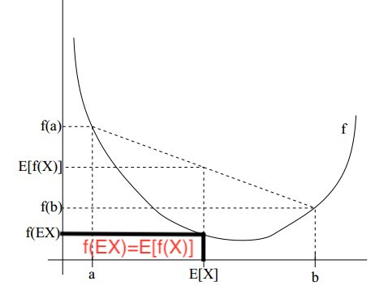

# EM

[TOC]

## 符号说明

| 符号      | 含义                               |
| --------- | ---------------------------------- |
| D         | 已有的数据(data)                   |
| θ         | 要估计的参数(parameter)            |
| p(θ)      | 先验概率(prior)                    |
| p(θ\|D)   | 后验概率(posterior)                |
| p(D)      | 数据分布(evidence)                 |
| p(D\|θ)   | 似然函数(likelihood of θ w.r.t. D) |
| p(x,θ\|D) | 已知数据条件下的x,θ概率            |

EM: 最大期望算法（Exception Maximization Algorithm，后文简称EM算法）

## 基本数学知识

### 极大似然估计

极大似然估计基于一种思想：概率最大的事情最容易出现；

假设现在有一系列事件$A=(A_1,A_2,\cdots, A_N)$发生了并且被观测到了，就有理由相信事件序列A发生的理论概率最大，求模型参数使得A发生得概率最大就是极大似然估计。

要想估计模型参数，需要事先知道是什么模型，然后构造该模型的似然函数，然后将已经观察到的样本数据代入似然函数，求参数使得似然函数最大即可。即：
$$
L(\theta) = \prod_{i=1}^NP(A_i|\theta) \quad 此为事件序列A的似然函数\\
\theta^* = arg\underset{\theta}{max}L(\theta)=arg\underset{\theta}{max}\prod_{i=1}^NP(A_i|\theta)
$$

### Jensen 不等式

当f(x)为严格凸函数时：$E[f(x)] \geq f(E[x])$,一图表所有。

只有当自变量x为常数时等号成立。

## EM 推导

我们经常会从样本观察数据中找出样本的模型参数，常用的方法是极大化模型分布的对数似然函数。

但是在一些情况下，模型中含有隐藏变量不能被观测到时，就无法用上述方法进行求最优解[^1]。此时需要用EM算法来迭代寻找最优解。

### EM算法的思想

简版：猜（E-step）,反思（M-step）,重复； 

啰嗦版：

你知道一些东西（观察的到的数据）， 你不知道一些东西（观察不到的），你很好奇，想知道点那些不了解的东西。怎么办呢，你就根据一些假设（parameter）先猜（E-step），把那些不知道的东西都猜出来，假装你全都知道了; 然后有了这些猜出来的数据，你反思一下，更新一下你的假设（parameter）, 让你观察到的数据更加可能(Maximize likelihood; M-stemp); 然后再猜，在反思，最后，你就得到了一个可以解释整个数据的假设了。

1. 注意，你猜的时候，要尽可能的猜遍所有情况，然后求期望（Expected）；
2. 为什么要猜，因为反思的时候，知道全部的东西比较好。（就是P(X,Z)要比P(X)好优化一些。Z是hidden states）
3. 最后你得到什么了？你得到了一个可以解释数据的假设，可能有好多假设都能解释数据，可能别的假设更好。不过没关系，有总比没有强，知足吧。（你陷入到local minimum了）

 ###　EM算法导出

下面通过近似求解观测数据的对数似然函数的极大化问题来导出ＥＭ算法。

我们已知如下数据：观测变量数据$Y = (y^1, y^2, \cdots, y^N)$，隐变量数据$Z=(z^1,z^2, \cdots, z^N)$，即每个样本属于哪个分布是未知的，这里$z^i=j$表示为第i个样本的隐变量对应的类别为类别j，也就是这里$z^i$不是标量，维度为隐变量类别的个数，意味着对于样本i属于各个类别的概率。（例如：在100男100女身高的混合高斯型中，隐变量的类别个数为2,男or女）。

求模型参数$\theta$

首先极大化观测数据（不完全数据）Ｙ关于参数$\theta$的对数似然函数，即极大化：
$$
\begin{align}
L(\theta) &= logP(Y|\theta) \\
	       & = \sum_{i=1}^NlogP(y^i|\theta) \\
	       & = \sum_{i=1}^Nlog\sum_{z^i}^{|z^i|}P(y^i, z^i|\theta) \quad 即，对某一个样本i，所有可能的类别集合z^i累加  \\
	       & = \sum_{i=1}^Nlog\sum_{z^i}^{|z^i|}P(y^i| z^i, \theta)P(z^i|\theta) \\
\end{align}
$$
极大化上式可能不容易，因为里面的未知变量除了$\theta​$之外还有z，无法直接求解。

我们针对上式继续推导一下，想办法把隐变量的分布加入到式子中：
$$
\begin{align}
L( \theta) & =  \sum_{i=1}^Nlog\sum_{z^i}^{|z^i|}P(y^i| z^i, \theta)P(z^i|\theta) \\
	        & 我们设有Q_i(z^i)是第i个样本关于隐变量z^i的概率分布，显然有\sum_{z^i}Q_i(z^i) = 1 \\
                 & =  \sum_{i=1}^Nlog\sum_{z^i}^{|z^i|}Q_i(z^i)\frac{P(y^i| z^i, \theta)P(z^i|\theta)}{Q_i(z^i)} \\
                 & = \sum_{i=1}^Nlog  E_{z^i \sim Q_i(z^i)}[\frac{P(y^i| z^i, \theta)P(z^i|\theta)}{Q_i(z^i)}] \\
                 & \geq \sum_{i=1}^N  E_{z^i \sim Q_i(z^i)}log[\frac{P(y^i| z^i, \theta)P(z^i|\theta)}{Q_i(z^i)}] \quad log函数是凹函数，根据Jensen不等式得此 \\
                 & =  \sum_{i=1}^N\sum_{z^i}^{|z^i|}Q_i(z^i)log\frac{P(y^i| z^i, \theta)P(z^i|\theta)}{Q_i(z^i)} \\
\end{align} \\
$$
上式给出了似然函数在$\theta$已知的情况下关于Q的函数的下界。

可以将对数似然函数写成有两类参数的形式：
$$
L(\theta, Q) = \sum_{i=1}^Nlog\sum_{z^i}^{|z^i|}Q_i(z^i)\frac{P(y^i| z^i, \theta)P(z^i|\theta)}{Q_i(z^i)} 
$$
 优化方法：

1. 给定初始值 $\theta^0$

2. E步(Expectation):固定$\theta^t$, 调整Q（Z），也就是选择一种隐含变量Z的分布使得对数似然函数的下界上升，其实看公式就知道调整Z的概率分布函数使得对数似然函数关于Z的期望最大！

   Jensen不等式等号成立时，下界达到最大，而等号成立的条件是对于的函数是常数值，也就是
   $$
   \frac{P(y^i| z^i, \theta^t)P(z^i|\theta^t)}{Q_i^t(z^i)} =c \\
   \sum_{z^i}Q_i^t(z^i) = 1 \\
   得到：\\
   Q_i^t(z^i) = \frac{P(y^i|z^i,\theta^t)P(z^i|\theta^t)}{\sum_{z^i}P(y^i|z^i,\theta^t)P(z^i|\theta^t)} \\
    = \frac{P(y^i,z^i|\theta^t)}{P(y^i, | \theta^t)} = P(z^i|y^i, \theta^t)
   $$

3. M步（Maximization):固定Q（Z），也就是固定隐含变量的概率分布，调整$\theta​$， 使得下界达到最大值；
   $$
   \theta^{t+1} = arg\underset{\theta}{max}\sum_{i=1}^N\sum_{z^i}^{|z^i|}Q_i^t(z^i)log\frac{P(y^i| z^i, \theta)P(z^i|\theta)}{Q_i^t(z^i)} \\
   =  arg\underset{\theta}{max}\sum_{i=1}^N\sum_{z^i}^{|z^i|}Q_i^t(z^i)logP(y^i, z^i| \theta) - \underbrace{\sum_{i=1}^N\sum_{z^i}^{|z^i|}Q_i^t(z^i)log{Q_i^t(z^i)}}_{常量} \\
   $$

4. 重复2,3直至达到退出条件

### 证明EM算法收敛

 要证明算法收敛，即证明：$L(\theta^{t+1}) \geq L(\theta^{t})$:
$$
L(\theta^{t+1}) = L(\theta^{t+1}, Q^t) \geq L(\theta^t,Q^t) \geq L(\theta^t,Q^{t-1}) = L(\theta^t) \\
第一个\geq由固定Q，更新\theta^t到\theta^{t+1}得M步得出；
第二个\geq由固定\theta^t更新Q^{t-1}到Q^t的E步得到；
$$

## 问题

1. 为什么极大化下界就可以逼近最优值？

2. EM算法到底是已知什么求什么？

   已知联合分布$P(Y,Z|\theta)$，条件分布$P(Z|Y, \theta)$；求模型参数$\theta$；

## 参考

1. https://blog.csdn.net/zengxiantao1994/article/details/72787849
2. https://blog.csdn.net/u011508640/article/details/72815981
3. https://www.cnblogs.com/pinard/p/6912636.html
4. https://www.zhihu.com/question/27976634
5. https://wenku.baidu.com/view/3396bb4d6294dd88d0d26bee.html
6. https://www.cnblogs.com/yahokuma/p/3794905.html

[^1]: 只所以包含隐藏变量的情况无法直接用极大似然估计，是因为这时有两类未知变量，1）模型的参数；2）在模型参数的影响下隐藏变量Z。他们互相影响，所以可以用迭代的方式逼近它们：固定一个，调整另外一个。

