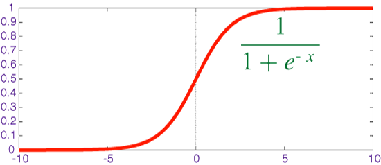
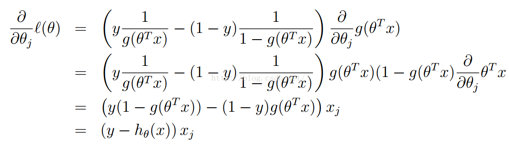
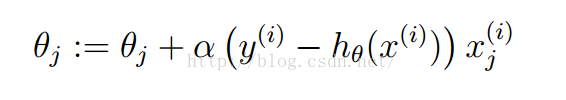
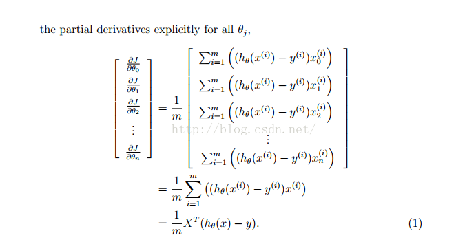
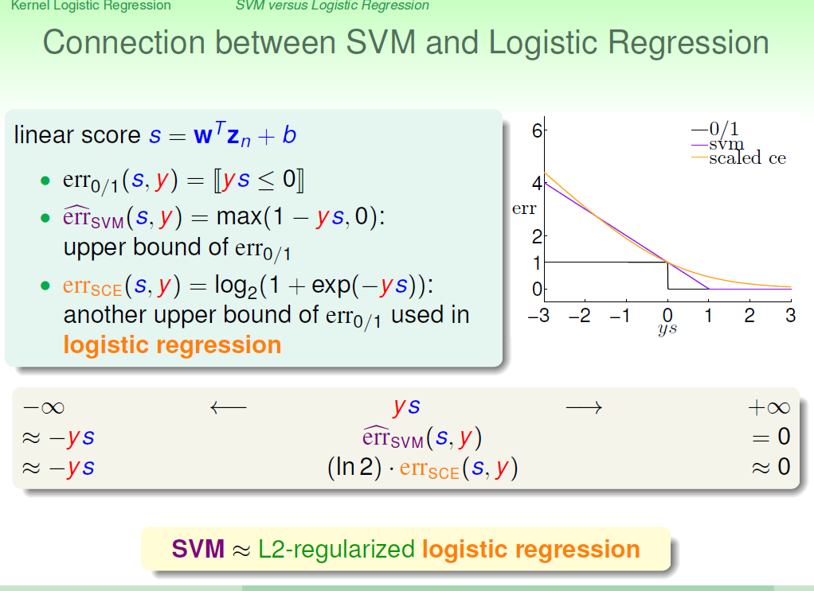
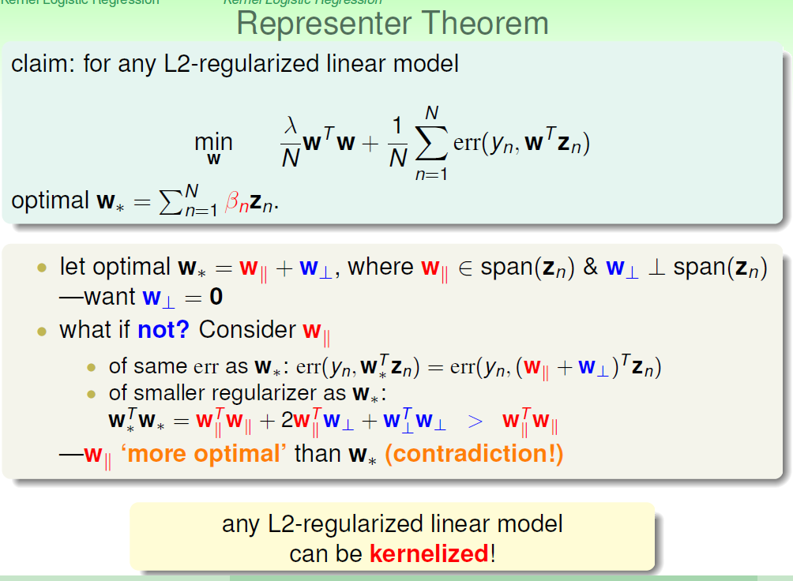
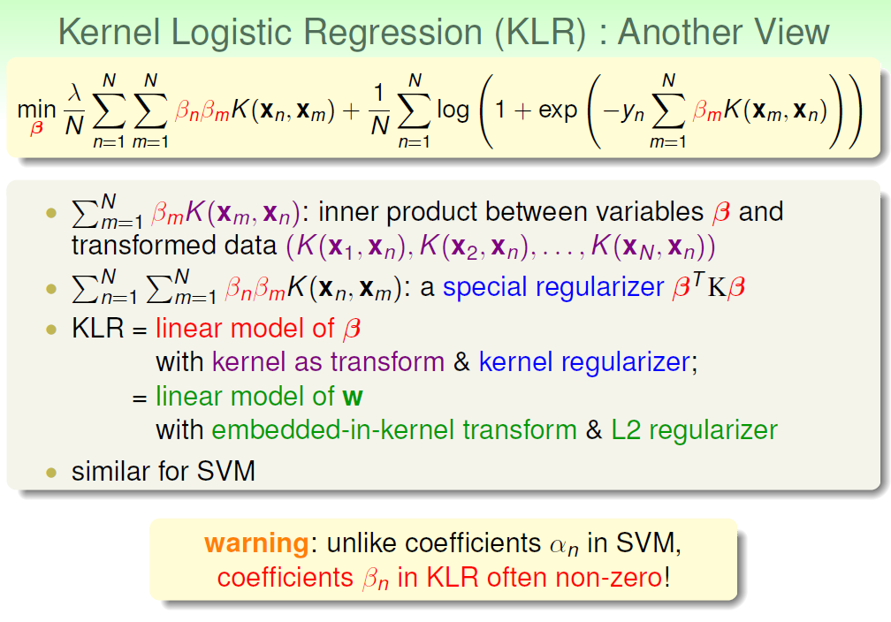
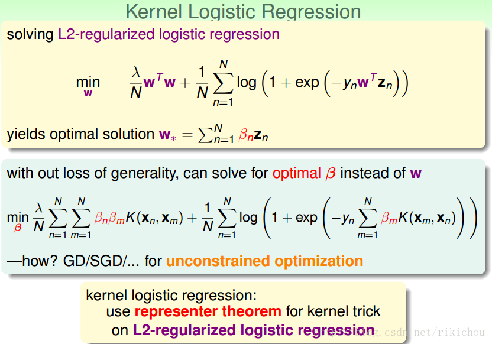

# Logistic Regress

[TOC]

## 模型

在线性拟合基础上,我们用logistic实现二分类问题.

### sigmoid函数

我们有$sigmoid$函数如下,
$$
g(z) = \frac{1}{1+e^{-z}}
$$
该函数图像为:

sigmoid函数有如下性质

* 连续,光滑

* 严格单调

* x趋于负无穷时,y趋于0；x趋于正无穷时,y趋于1

* 定义域为$(-\infty, +\infty)$

* 值域为(0,1)

* 处处可导,并且导数为$g'(x) = g(x)(1-g(x))$

  $g(x) = (1+e^{-x})^{-1} $推导如下,根据复合函数求导法则:
  $$
  \begin{align}
  v & = -x \\
  u & = e^v  = e^{-x}\\
  w & = 1+u = 1 + e^{-x}\\
  g & = w^{-1} = (1+e^{-x})^{-1}\\
  & => \\
  g'(x) & = \frac{dg}{dw}\cdot \frac{dw}{du} \cdot \frac{du}{dv} \cdot \frac{dv}{dx} \\
  & =-w^{-2} \cdot 1 \cdot e^v \cdot -1 \\
  & = (1+e^{-x})^{-2} \cdot e^{-x} \\
  & = \frac{e^{-x}}{1+e^{-x}} \cdot \frac{1}{1+e^{-x}} \\
  & = g(x)\cdot(1-g(x))
  \end{align}
  $$

### 伯努力分布

那么,为什么sigmoid可以用到logistic回归问题上呢?

除了数学上更容易处理之外,还有其本身的推导特性; 对于分类问题,尤其是二分类问题,我们都假定是服从伯努力分布；伯努力分布的概率质量函数为(只是对于离散信号而言，我们一般比较熟悉的概率密度函数是对于连续信号。):
$$
P(y=1) = p \\ 
P(y=0)=1-p \\
f(y|p) = p^y\cdot(1-p)^{1-y}
$$
将其表示为指数分布族的一般形式为:
$$
f(y; \eta) = b(y)exp(\eta^TT(y)-a(\eta))
$$
其中，$\eta$是分布的**自然参数**（natural parameter）或**典范参数**（canonical parameter），T(y)叫做**充分统计量**（sufficient statistic），通常情况下T(y)=y；a($\eta$)是**对数分配函数**（log partition function），而a、b与T一般都是给定的，随着η的变化，会得到不同的分布。

伯努力分布可表示为:
$$
\begin{align}
f(y;p) & = exp(ln(p^y\cdot(1-p)^{1-y})) \\
& = exp(yln(p) + (1-y)ln(1-p)) \\
& =exp((ln(p)-ln(1-p)y + ln(1-p))) \\
& = exp(ln(\frac{p}{1-p})y + ln(1-p))
\end{align}
$$

对应标准表达式
$$
b(y)=1, \eta=ln(\frac{p}{1-p}), T(y)=y, a(\eta)=-ln(1-p)
$$
其中,由$\eta=ln(\frac{p}{1-p})$可以推出:
$$
\begin{align}
& \eta = ln(\frac{p}{1-p}) \\
& exp^{\eta} = \frac{p}{1-p} \\
& exp^{\eta} - pexp^{\eta} = p \\
& p = \frac{exp^{\eta}}{1+exp^{\eta}} \\
& p = \frac{1}{1+exp^{-\eta}} = g(\eta)
\end{align}
$$
由于广义线性模型中,自然参数$\eta$与输入特征x之间呈线性关系,即

实数时, $\eta = \theta^Tx$

向量时, $\eta_i=\theta_i^Tx$

因此,有

$f_{\theta}(x) = P(y=1|x;\theta) = p = g(\eta) = g(\theta^Tx) = \frac{1}{1+exp^{-\theta^Tx}}$

### logistic 回归模型

至此,我们要的模型终于浮出水面了,在给定了x和$\theta$时,y=1的概率如下:
$$
P(y=1|x;\theta) = h_{\theta}(x) = \frac{1}{1+exp^{-\theta^Tx}}
$$

## 策略

模型有了,那么下一步就是要采取什么策略来学习模型中的各个参数了.

假设现在有如下数据:

$D={(X_1, Y_1),(X_2,Y_2),\cdots, (X_m,Y_m)}$
$$
\begin{align}
X & = \begin{bmatrix} 1 & x_1^1 & x_2^1 & \cdots & x_n^1 \\ 1& x_1^2 & x_2^2 & \cdots & x_n^2 \\ \vdots  & \vdots & \vdots & \ddots & \vdots \\1&x_1^m & x_2^m & \cdots &x_n^m\end{bmatrix} ,
x^i_j表示第i个样本的第j个feature
\\
  Y &= \begin{bmatrix} y^1 \\ y^2 \\ \vdots \\ y^m\end{bmatrix} ,
   y^i \in \{0,1\} \\
  W&=\begin{bmatrix}w_0 \\ w_1 \\ \vdots \\ w_n \end{bmatrix}
 \end{align}
$$

### 极大似然估计

m个样本,似然函数为
$$
\begin{align}
L(\theta) &= \prod_{i=1}^mP(y^i|x^i;\theta) \\
\end{align}
$$
其中 
$$
P(y|x;\theta) = 
\begin{cases}
h_\theta(x) &\text{ if } y = 1 \\
1-h_\theta(x)  &\text{ if } y =0 \\
\end{cases}
\\ => 
p(y|x;\theta)=h_\theta(x)^y\cdot (1-h_\theta(x))^{1-y} \\
=> L(\theta) = \prod_{i=1}^mh_\theta(x^i)^{y^i}(1-h_\theta(x^i))^{1-y^i}
$$
为了方便计算,取对数似然函数:
$$
l(\theta) =log L(\theta) = \sum_{i=1}^m[y^ilogh_\theta(x^i) + (1-y^i)log(1-h_\theta(x^i))]
$$
然后求$\theta$使$l(\theta)$的值最大,即为极大似然估计；具体求解方法可用梯度下降,拟牛顿法来求最优值.

问：是否可以用类似最小二乘法的方法用矩阵求导的方法推出最优解的计算公式？

试着在这里推一下：

吴老师这里推得是损失函数的偏导，我前面推得是似然函数的偏导。所以他们符号相反。

把对数似然函数写成向量的形式：
$$
l(\theta) = y^Tlogh_{\theta}(X) + (1-y)^Tlog(1 - h_{\theta}(X)) \\
h_{\theta}(X) = g(X\theta) \\
\frac{\part l}{\part{\theta}} = \frac{1}{m}X^T(h_{\theta}(x)-y)
$$
令导数为0求解$\theta$
$$
X^T(h_{\theta}(x)-y) = 0 \\
X^Tg(X\theta) = X^Ty \\
XX^T g(X\theta) = XX^Ty \\
g(X\theta) = (XX^T)^{-1}XX^Ty \\
\frac{1}{1+e^{-X\theta}} = (XX^T)^{-1}XX^Ty \\
1 + e^{-X\theta} = \frac{1}{(XX^T)^{-1}XX^Ty} \\
e^{-X\theta} = \frac{1}{(XX^T)^{-1}XX^Ty} - 1 \\
-X\theta = log(\frac{1}{(XX^T)^{-1}XX^Ty} - 1) \\
X\theta = -log(\frac{1}{(XX^T)^{-1}XX^Ty} - 1) \\
\theta = -(X^TX)^{-1}X^Tlog(\frac{1}{(XX^T)^{-1}XX^Ty} - 1)
$$
这样对么？

问：为什么$l(\theta)$为凸函数？

SVM ≈ L2-regularized logistic regression。

### ## kernel logistic regression

能不能直接做kernel logistic regression？

首先明白一点：**要想使用kernel trick，必然有：w可以由n个数据来表示。也即：optimal w can be represented by zn**。

软间隔SVM的用对数损失函数相当于Logistic Regress的L2 regularization?

看起来是的。

## 参考

1. https://blog.csdn.net/lizhe_dashuju/article/details/49864569
2. https://blog.csdn.net/saltriver/article/details/57531963
3. https://blog.csdn.net/baidu_15238925/article/details/81291247
4. https://www.cnblogs.com/wallacup/p/6024855.html?utm_source=itdadao&utm_medium=referral