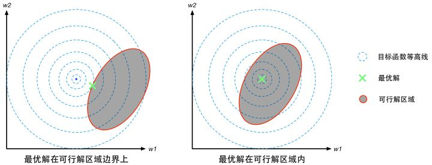
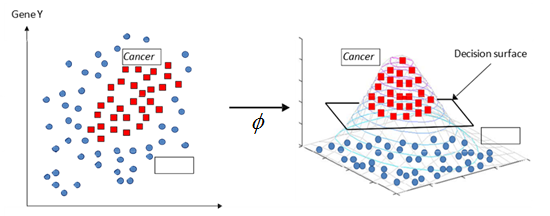
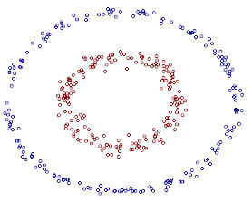
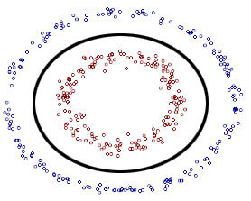

# SVM

[TOC]

## 线性可分SVM和硬间隔最大化

### 目标

有如下数据$D=\{x_i,y_i\}, i=1,2,\cdots,N; 其中 x\in R^{n}, y\in \{-1,1\}$，此处$x_i$为n维列向量；

对于给定training data（线性可分），分类模型$f(x)=w^Tx+b, (w \in R^n)$使得所有分类都正确，并且使得分类间隔最大化。

### 间隔最大化

某个点到分类平面的距离为：

$$d = \frac{\left|w^Tx+b\right|}{\left || w\right ||}$$

而对于所有的正负样本$(x_i, y_i)， i = 1,2,\cdots, N$，可以通过等比放缩w和b使得：
$$
w^Tx^++b >= +1 \\
w^Tx^-+b <=-1
$$
而由于对于正负样本y的取值分别为+1和-1，因此上式可统一写为如下形式：
$$
y_i(w^Tx_i + b) >= 1
$$
而对于分类间隔边缘的正负样本点$x_i^+$和$x_j^-$，有
$$
w^Tx_i^++b = +1 \\
w^Tx_j^-+b =-1
$$
这时，分类间隔的值为位于分类间隔边缘的正负样本到分类平面的距离之和，即：
$$
\begin{align}
d &= d_i + d_j \\
& = \frac{\left|w^Tx_i + b\right|}{\left ||w \right||} + \frac{\left|w^Tx_j + b\right|}{\left||w \right||} \\
& = \frac{\left| +1 \right|}{\left ||w \right||} + \frac{\left|-1\right|}{\left ||w \right||} \\
& = \frac{2}{\left ||w \right||}
\end{align}
$$
此时，该问题可以表示成有约束的最优化问题，即
$$
\underset{w,b}{max} \frac{2}{\left||w\right||}\\
s.t. \\
y_i(w^Tx_i+b) >= 1, i=1,2,\cdots, N
$$
上述问题问题的解$w^*,b^*$可构成分类间隔最大的分类平面。为了计算方便，通常我们写成等价的如下形式：
$$
\underset{w,b}{min} \frac{1}{2}\left || w\right ||^2 \\
s.t. \\
1-y_i(w^Tx_i+b) <= 0, i=1,2,\cdots, N
$$
求得最优解 $w^*, b^*$, 则分类超平面为$w^*x+b=0$，分类决策函数为$f(x) = sign(w^*x+b)$。

## 优化

### 拉格朗日乘子法

拉格朗日乘子法是一种寻找多元函数在一组约束下的极值的方法。通过引入拉格朗日橙子，可将有d个变量与k个约束条件的最优化问题转化为具体d+k个变量的无约束最优化问题求解。

#### 等式约束

原始问题如下：
$$
\underset{x \in R^d}{min}f(x) \\
s.t. \\
g_i(x) = 0, i=1,2,\cdots,k
$$
从几何角度看，该问题的目标是在由方程$g_i(x) = 0$确定的d-1维曲面上寻找能使目标函数f(x)最小化的点，此时不难得到如下结论：

* 对于约束曲面上的任意点x， 该点的梯度$\triangledown_xg_i(x)$正交于约束曲面；

  见参考2，函数z=f(x,y)在点p(x,y)的梯度的方向与过点p的等高线f(x,y)=c在这点的法线一个方向相同。梯度的方向与等高线切线方向垂直

* 在最优点$x^*$，目标函数在该点的梯度$\triangledown_xf(x^*)$正交于约束平面。

  可通过反证法证明：若梯度$\triangledown_xf(x^*)$与约束曲面不正交，则仍可在约束曲面上移动该点使f(x)的函数值进一步下降。

由此可知，在最优点$x^*$处，梯度$\triangledown_xg_i(x^*)和\triangledown_xf(x^*))$的方向必相同或相反，即存在$\alpha_i \neq 0$使得：
$$
\alpha_i\triangledown_xg_i(x^*) + \triangledown_xf(x^*) = 0
$$
$\alpha_i$称为拉格朗日乘子（对于等式约束 $\alpha$可能为正也可能为负）。

定义拉格朗日函数如下：
$$
L(x, \alpha) = f(x) + \sum_{i=1}^k \alpha_i g_i(x)
$$
不难发现：
$$
\frac{\part{L(x,\alpha)}}{\part x}=0，\\
 即：\triangledown_xf(x)+\sum_{i=1}^k\alpha_i\triangledown_xg_i(x) = 0 \\
 \frac{\part{L(x,\alpha)}}{\part \alpha}=0, \\
 即约束条件：g(x) = 0 \\
 注意，这里的x\in R^d，\alpha \in R^k都是向量而不是标量，\\
 也就是这里的0也不是标量，而是指0向量，即所有元素为0
$$
于是，原始约束最优化问题可转化为对拉格朗日函数$L(x,\alpha)​$的无约束最优化问题。

#### 不等式约束

现在考虑不等式约束，暂时只考虑一个不等式约束的情况。

假设有如下问题：
$$
\underset{x \in R^d}{min} f(x) \\
s.t. g(x) <= 0
$$
不等式约束的时候，类似等式约束，从几何角度看，该问题的目标是在由方程$g(x) <= 0$确定的d维空间的一部分（半空间？）上寻找能使目标函数f(x)最小化的点。最优点$x^*$所在位置有两种可能:

1. 在边界g(x)=0的曲面上; 

   这种情况类似于等式约束,但是有一点不一样,此时 $\triangledown_xg_i(x^*)和\triangledown_xf(x^*))$的方向必相反,即存在常数$\alpha>0$使得$\alpha_i\triangledown_xg_i(x^*) + \triangledown_xf(x^*) = 0$. 

   至于为什么? 参考下图左边,函数f(x)在最优解$x^*$附近变化的趋势是在可行解区域内侧较大外侧较小,而与之对应的是函数g(x)在可行解区域内侧小于0,区域外侧大于0,所以在最优解$x^*$附近的变化趋势是内部较小外部较大,意味着两者梯度方向相反,因此可推断出$\alpha>0$.

2. 在g(x)<0的地方.

   这种情况的时候约束不起作用,等同于无约束的f(x)的最优解,可以直接通过$\triangledown_xf(x)=0$来获得最优点,这等价于将$\alpha$置0然后对$\triangledown_xL(x,\alpha)$置0得到最优点.



整合两种情况,必满足$\alpha g(x) = 0$,因此在约束g(x)<=0的约束下最小化f(x)可转化为如下约束最小化拉格朗日函数:
$$
\underset{x \in R^d}{min}L(x, \alpha) = f(x) + \alpha g(x) \\
s.t. g(x) <=0 \\
\alpha >= 0 \\
\alpha g(x) = 0
$$
上式称KKT条件.

#### 推广

推广到多个约束: m个等式约束和n个不等式约束,且可行域$D\subset R^d$非空的优化问题:
$$
\underset{x \in R^d}{min}f(x) \\
s.t. \\
h_i(x) =0, (i=1,2,\cdots,m) \\
g_j(x) <=0, (j=1,2,\cdots, n)
$$
上式称为主问题.

引入拉格朗日乘子$\alpha = (\alpha_1, \alpha_2, \cdots, \alpha_m)^T$和$\mu = (\mu_1, \mu_2, \cdots, \mu_n)^T$,相应的拉格朗日函数为:
$$
L(x, \alpha, \mu) = f(x) + \sum_{i=1}^m\alpha_ih_i(x) + \sum_{j=1}^m\mu_jg_j(x) \\
\begin{align}
& s.t. \\
& g_j(x) <=0, j=(1,2,\cdots,n) \\
& \mu_j >= 0, j=(1,2,\cdots,n)\\
& \mu_j g_j(x) = 0,j=(1,2,\cdots,n) \\
\end{align}
$$
以上为主问题的拉格朗日乘子函数,其拉格朗日对偶函数为:
$$
\Gamma(\alpha, \mu) = \underset{x \in D}{inf}L(x, \alpha, \mu) \\
 = \underset{x\in D}{inf}\left( f(x) + \sum_{i=1}^m\alpha_ih_i(x) + \sum_{j=1}^m\mu_jg_j(x) \right) \\
 这里inf的意思为下确界，没太理解，可想象成最小值min符号，但是又不是（数学上不严谨）
$$
此函数通常通过将拉格朗日乘子$L(x, \alpha, \mu)​$对x求偏导并令其等于0来获得用$\alpha和\mu​$来表示x的表达式,以此来获得对偶函数的表达形式.

若$\tilde{x} \in D$为主问题可行域中任意一点,则对于任意$\mu >= 0$和$\alpha$都有:
$$
\sum_{i=1}^m\alpha_ih_i(x) + \sum_{j=1}^m\mu_jg_j(x)  <=0
$$
进而有
$$
\Gamma(\alpha, \mu) = \underset{x \in D}{inf}L(x, \alpha, \mu) <= L(\tilde{x}, \alpha, \mu) <= f(\tilde{x})
$$
若主问题的最优值为$p^*$,则对于任意$\mu >= 0$和$\alpha$都有:
$$
\Gamma(\alpha, \mu) <= p^*
$$
即对偶函数给出了主问题最优值的下界.

显然,这个下界取决于$\mu$和$\alpha$的值,于是一个很自然的问题是:基于对偶函数能获得的最好下界是什么?这就引出了优化问题: 
$$
\underset{\alpha, \mu>=0}{max}{\Gamma(\alpha,\mu)}
$$
该式就是主问题的对偶问题,其中$\alpha​$和$\mu​$称为对偶变量,无论主问题的凸性如何,对偶问题始终是凸优化问题(问题1).

若对偶问题的最优值为$d^*$,显然有$d^* <= p^*$,这称为弱对偶性;若$d^* = p^*$称为强对偶性,此时由对偶问题能获得主问题的最优下界.

那么强对偶性什么时候成立呢?当如下条件满足时强对偶性成立:

1. 主问题为凸优化问题,即f(x)和$g_j(x)$均为凸函数,$h_i(x)$为仿射函数;
2. 可行域中至少有一点使不等式约束严格成立,即存在x对所有j有$g_j(x)<0$都成立.

在强对偶性成立时,将拉格朗日函数分别对原变量和对偶变量求导,再令导数等于0,即可得到原变量与对偶变量的数值关系.于是对偶问题解决了,主问题也就解决了.

##### 定理

对主问题和对偶问题，假设满足上述强对偶性条件；则$x^*和\alpha^*,\mu^*$分别是主问题和对偶问题的解的充分必要条件是$x^*, \alpha^*,\mu^*$满足下面的KKT条件
$$
\begin{align}
& \triangledown_xL(x^*, \alpha^*,\mu^*) = 0 \\
& \triangledown_\alpha L(x^*, \alpha^*,\mu^*) = 0 \\
& \triangledown_\mu L(x^*, \alpha^*,\mu^*) = 0 \\
& g_j(x) <=0, j=(1,2,\cdots,n) \\
& \mu_j >= 0, j=(1,2,\cdots,n)\\
& \mu_j g_j(x) = 0,j=(1,2,\cdots,n) \\
& h_i(x) =0, (i=1,2,\cdots,m) \\
\end{align}
$$

#### 优化方法

##### 二次规划(Quadratic Programming, QP)

##### 半正定规划(Semi-Definite Programming, SDP)


### 线性可分SVM问题优化

好了，我们的目的是优化SVM分类时的最大间隔，回到我们的优化目标：
$$
\underset{w,b}{min} \frac{1}{2}\left || w\right ||^2 \\
s.t. \\
1-y_i(w^Tx_i+b) <= 0, i=1,2,\cdots, N
$$
构造拉格朗日函数$\alpha=(\alpha_1,\cdots,\alpha_N)^T$：
$$
L(w,b,\alpha) = \frac{1}{2}\left|\left|w\right|\right|^2 + \sum_{i=1}^N\alpha_i(1-y_i(w^Tx_i+b)) \\
s.t. \\
1-y_i(w^Tx_i+b) <= 0, i=1,2,\cdots, N \\
\alpha_i >= 0, i=1,2,\cdots, N \\
\alpha_i\left(1-y_i(w^Tx_i+b)\right)= 0, i=1,2,\cdots, N
$$


原始问题的对偶问题是极大极小问题：
$$
\underset{\alpha}{max} \underset{w,b}{min}L(w,b,\alpha) \\
严格来说应该是这样：
\underset{\alpha}{max} \underset{w,b}{inf}L(w,b,\alpha) \\
至于为什么可以写成min不确定，猜测可能是强对偶问题所以等价？问题部分。
$$
为了得到对偶问题的解，需要先求$L(w,b,\alpha)$对w,b的极小，再求对$\alpha$的极大。

1. 求$\underset{w,b}{min}L(w,b,\alpha)$

   将拉格朗日函数$L(w,b,\alpha)$分别对w和b求偏导并令其等于0：
   $$
   \triangledown_wL(w,b,\alpha) = w -\sum_{i=1}^N\alpha_iy_ix_i = 0 \\
   \triangledown_bL(w,b, \alpha) = -\sum_{i=1}^N\alpha_iy_i = 0
   $$
   用到如下求导公式
   $$
   \frac{dx^T}{dx} = I \\
   \frac{d(u^Tv)}{dx} = \frac{d(u^T)}{dx}\cdot v + \frac{d(v^T)}{dx}\cdot u \\
   \frac{d\left|\left|x\right|\right|^2}{dx} = \frac{d(x^Tx)}{dx} = \frac{dx^T}{dx}\cdot x +  \frac{dx^T}{dx}\cdot x=2x \\
   \frac{d(x^TA)}{dx} = \frac{d(x^T)}{dx}\cdot A + \frac{dA}{dx}\cdot x = A  , (A是与x维度相同的列向量,\frac{dA}{dx}=0)
   $$
   得：
   $$
   w^* = \sum_{i=1}^N\alpha_iy_ix_i \\
   \sum_{i=1}^N\alpha_iy_i = 0
   $$
   将w和b带入拉格朗日函数得：
   $$
   \begin{align}
   L(w,b,\alpha) & =\frac{1}{2}\left|\left|w\right|\right|^2 + \sum_{i=1}^N\alpha_i(1-y_i(w^Tx_i+b)) \\
   &= \frac{1}{2}\left(\sum_{i=1}^N\alpha_iy_ix_i\right)^T\left(\sum_{i=1}^N\alpha_iy_ix_i\right) + \sum_{i=1}^N\alpha_i(1-y_i(\left(\sum_{j=1}^N\alpha_jy_jx_j\right)^Tx_i + b)) \\
   & x_i为列向量，\alpha_i y_i都为标量，x_i^Tx_j 为标量等价于x_i \cdot x_j \\
   & = \frac{1}{2}\sum_{i=1}^N\sum_{j=1}^N\alpha_i\alpha_jy_iy_j(x_i \cdot x_j) - \sum_{i=1}^N\sum_{j=1}^N\alpha_i\alpha_jy_iy_j(x_i \cdot x_j) - \sum_{i=1}^N\alpha_iy_ib + \sum_{i=1}^N\alpha_i \\
   & = \sum_{i=1}^N\alpha_i - \frac{1}{2}\sum_{i=1}^N\sum_{j=1}^N\alpha_i\alpha_jy_iy_j(x_i \cdot x_j) \\
   即：\\
   \underset{w,b}{min}L(w,b,\alpha) & =  \sum_{i=1}^N\alpha_i - \frac{1}
   {2}\sum_{i=1}^N\sum_{j=1}^N\alpha_i\alpha_jy_iy_j(x_i \cdot x_j) \\
   \end{align} \\
   $$

2. 求对偶函数$\underset{w,b}{min}L(w,b,\alpha)​$对$\alpha​$的极大：
   $$
   \underset{\alpha}{max}\underset{w,b}{min}L(w,b,\alpha)\\
   即：\\
   \underset{\alpha}{max} \left [\sum_{i=1}^N\alpha_i - \frac{1}
   {2}\sum_{i=1}^N\sum_{j=1}^N\alpha_i\alpha_jy_iy_j(x_i \cdot x_j) \right]\\ 
   s.t. \\
   \sum_{i=1}^N\alpha_iy_i = 0 \\
   \alpha_i >=0, i=1,2,\cdots,N
   $$
   将极大换成极小，得到下面等价的对偶最优化问题：
   $$
   \underset{\alpha}{min} \frac{1}
   {2}\sum_{i=1}^N\sum_{j=1}^N\alpha_i\alpha_jy_iy_j(x_i \cdot x_j) - \sum_{i=1}^N\alpha_i \\ 
   s.t. \\
   \sum_{i=1}^N\alpha_iy_i = 0 \\
   \alpha_i >=0, i=1,2,\cdots,N \\
   $$
   由于原始问题满足强对偶条件，所以存在$w^*,b^*,\alpha^*$,使$w^*,b^*$为原始问题的最优解，$\alpha^*$为对偶问题的解，意味着求解原始问题，可以转化为求解对偶问题。

   可以用SMO算法求解最优的$\alpha^*$

##### SMO

Todo


### 引出分类平面只依赖输入与训练输入的向量内积相关

对线性可分数据集，假设对偶问题的解为$\alpha^*=(\alpha_1,\alpha_2, \cdots,\alpha_N)^T$，接下来由$\alpha^*$求得原始问题的最优解为$w^*,b^*$.

根据拉格朗日定理（$x^*和\alpha^*,\mu^*$分别是主问题和对偶问题的解的充分必要条件是$x^*, \alpha^*,\mu^*$满足的KKT条件）可得：
$$
\triangledown_xL(w^*,b^*,\alpha^*) = w^*-\sum_{i=1}^N\alpha_iy_ix_i = 0 \\
\triangledown_bL(w^*,b^*,\alpha^*) = -\sum_{i=1}^N\alpha_iy_i=0 \\
1-y_i(w^Tx_i+b) <= 0, i=1,2,\cdots, N \\
\alpha_i >= 0, i=1,2,\cdots, N \\
\alpha_i\left(1-y_i(w^Tx_i+b)\right)= 0, i=1,2,\cdots, N
$$
由此得
$$
w^* =\sum_{i=1}^N\alpha_i^*y_ix_i
$$
其中至少有一个$\alpha_j>0​$此处样本j即为支持向量(反证法：若所有$\alpha^*​$的元素都为0，则$w^*​$为0，而$w^*=0​$不是原始问题的解；为什么呢？因为如果w为0的情况，输出y与输入x无关，这不符合机器学习的目的)，对此j有如下成立：
$$
y_j(w^{*T}x_j+b^*) - 1 = 0
$$
将$w^* =\sum_{i=1}^N\alpha_iy_ix_i$带入该式得：
$$
y_j(\sum_{i=1}^N\alpha_iy_ix_i)^Tx_j + y_jb^* - 1 = 0 \\
b^* = 
\left\{\begin{matrix}
1 -(\sum_{i=1}^N\alpha_i^*y_ix_i)^Tx_j, \text{ if } y_j =1 \\
-1 -(\sum_{i=1}^N\alpha_i^*y_ix_i)^Tx_j, \text{ if } y_j =-1 
\end{matrix}\right. \\
整理上式得\\
b^*=y_j- (\sum_{i=1}^N\alpha_i^*y_ix_i)^Tx_j = y_j - \sum_{i=1}^N\alpha_i^*y_i(x_i \cdot x_j)
$$
现在w和b都有了，那么我们的分离超平面也有了：
$$
w^{*T}x+b^* = 0， 即\\
\sum_{i=1}^N\alpha_i^*y_i(x_i\cdot x) + \left(y_j - \sum_{i=1}^N\alpha_i^*y_i(x_i \cdot x)\right) = 0
$$
从上式可以看出，分类决策函数只依赖于输入x和训练样本输入的内积。


## 线性SVM和软间隔最大化

上面线性可分SVM的算法对线性不可分训练数据是不适用的，因为这时上述方法中的不等式约束不能总是成立，要想办法扩展到线性不可分问题上，这里需要修改硬间隔最大化，引入软间隔最大化。

有如下数据$D=\{x_i,y_i\}, i=1,2,\cdots,N; 其中 x\in R^{n}, y\in \{-1,1\}$，此处$x_i$为n维列向量；这些训练数据不是线性可分的，通常情况是，训练数据中，有一些特异点，将这些特异点去除之后，剩下的大部分的样本点组成的集合是线性可分的。

线性不可分意味着某些样本点$(x_i, y_i)$不能满足函数间隔大于等于1的约束条件，为了解决这个问题，可以对每个样本点$(x_i,y_i)$引入一个松弛变量$\xi_i \geq 0$s使得函数间隔加上松弛变量大于等于1，即，约束变为:
$$
y_i(w^Tx_i + b) + \xi_i \geq 1
$$
同时，对每个$\xi_i$支付一个代价C。目标函数由原来的$\frac{1}{2}\left|\left| w\right|\right|^2$变成：
$$
\frac{1}{2}\left|\left| w\right|\right|^2 + C\sum_{i=1}^N\xi_i
$$
这里C>0称为惩罚参数：

* C越大，对误分类的惩罚增大
* C越小，对误分类的惩罚减小

最小化上式意义为，是间隔尽量大，同时使误分类点的个数尽量小，这两者是此消彼长的，C是调和二者的系数。

根据上面思路，考虑训练数据线性不可分时，线性SVM的学习问题，称为软间隔最大化。 线性不可分的线性SVM的学习问题转化为一下凸二次优化问题（原始问题）：
$$
\underset{w,b.\xi}{min} \quad \frac{1}{2}\left|\left| w\right|\right|^2 + C\sum_{i=1}^N\xi_i \\
s.t. \quad y_i(w^Tx_i+b) + \xi_i \geq 1,  \quad i=1,2,\cdots,N \\
\xi_i \geq 0, \quad i=1,2,\cdots,N
$$
该问题是一个凸二次优化问题，因此此问题的解是存在的，假设问题的解是$w^*,b^*$,于是可以得到分类超平面为$w^*x+b^*=0$及分类决策函数$f(x)=sign(w^*x+b^*)$

### 线性SVM问题优化

同样的，采用拉格朗日乘子法，引入拉格朗日函数：
$$
L(w,b,\xi, \alpha, \mu) =\frac{1}{2}\left|\left| w\right|\right|^2 + C\sum_{i=1}^N\xi_i  + \sum_{i=1}^N\alpha_i(1 - y_i(w^Tx_i+b) - \xi_i) - \sum_{i=1}^N\mu_i\xi_i
$$
对偶函数为拉格朗日的极大极小函数

1. 首先求$L(w,b,\xi,\alpha,\mu)$对$w,b,\xi$的极小，由：
   $$
   \triangledown_wL(w,b,\xi,\alpha,\mu) = w -\sum_{i=1}^N\alpha_iy_ix_i = 0 \\
   \triangledown_bL(w,b, \xi, \alpha, \mu) = -\sum_{i=1}^N\alpha_iy_i = 0 \\
   \triangledown_\xi L(w,b,\xi,\alpha,\mu) = CI - \alpha - \mu \quad = 0\\
   (此处I为元素为1的N×1维列向量，\alpha和\mu为N×1的列向量，求得的\xi同样是N×1的列向量) \\
   最后一项也可写成分开的形式： \\
   \triangledown_{\xi_i} L(w,b,\xi, \alpha, \mu) = C - \alpha_i - \mu_i = 0, \quad i=1,2,\cdots,N
   $$
   其中用到求导公式：
   $$
   \frac{d(\sum_{i=1}^N\xi_i)}{d\xi}, \quad 其中\xi为N×1的向量\\
   相当于构造 向量 I 全为1的N维列向量 \\
   \sum_{i=1}^N\xi_i相当于I^T\xi \\
   根据向量求导公式： \frac{dAx}{dx} = A^T \\
   因此：
   \frac{d(\sum_{i=1}^N\xi_i)}{d\xi} = \frac{dI^T\xi}{d\xi} = I \\
   $$
   求解上式得到使得L取得最优的$w^*,b^*,\xi^*$
   $$
   w* = \sum_{i=1}^N\alpha_iy_ix_i \\
   \sum_{i=1}^N\alpha_iy_i =0  \\
   C-\alpha_i-\mu_i = 0, \quad i=1,2,\cdots,N
   $$
   将上面3式带入拉格朗日函数得：
   $$
   \begin{align}
   \underset{w,b,\xi}{min}L(w,b,\xi,\alpha, \mu) &= \frac{1}{2} \sum_{i=1}^N\sum_{j=1}^N\alpha_i\alpha_jy_iy_j(x_i \cdot x_j) - \sum_{i=1}^N\sum_{j=1}^N\alpha_i\alpha_jy_iy_j(x_i \cdot x_j)  + \sum_{i=1}^N\alpha_i  \\
   & + \sum_{i=1}^N\alpha_iy_ib +  C\sum_{i=1}^N\xi_i  + \sum_{i=1}^N\alpha_i\xi_i - \sum_{i=1}^N\mu_i\xi_i； \\
   & \quad 后面这些项为0 \\
   & = \sum_{i=1}^N\alpha_i - \frac{1}{2} \sum_{i=1}^N\sum_{j=1}^N\alpha_i\alpha_jy_iy_j(x_i \cdot x_j) 
   \end{align}
   $$
   由此得出原始问题的对偶问题：
   $$
   \underset{\alpha,\mu}{max}\underset{w,b,\xi}{min}L(w,b,\xi,\alpha, \mu) = \underset{\alpha,\mu}{max}\sum_{i=1}^N\alpha_i - \frac{1}{2} \sum_{i=1}^N\sum_{j=1}^N\alpha_i\alpha_jy_iy_j(x_i \cdot x_j)  \\
   s.t. \quad \sum_{i=1}^N\alpha_iy_i =0  \\
   C-\alpha_i-\mu_i = 0, \quad i=1,2,\cdots,N \\
   \alpha_i \geq 0, \quad i=1,2,\cdots,N \\
   \mu_i \geq 0, \quad i=1,2,\cdots,N
   $$
   假设现在已经求得了该对偶问题的最优解$\alpha^*,\mu^*$(用SMO算法或是其他)，接下来就是要求$w^*,b^*$来确定分类平面，由拉格朗日定理（$x^*和\alpha^*,\mu^*$分别是主问题和对偶问题的解的充分必要条件是$x^*, \alpha^*,\mu^*$满足的KKT条件）：
   $$
   \triangledown_wL(w^*,b^*,\xi^*, \alpha^*,\mu^*) = w^* -\sum_{i=1}^N\alpha_i^*y_ix_i = 0 \\
   \triangledown_bL(w^*,b^*,\xi^*, \alpha^*,\mu^*) = -\sum_{i=1}^N\alpha_i^*y_i = 0 \\
   \triangledown_\xi L(w^*,b^*,\xi^*, \alpha^*,\mu^*) =C - \alpha^* - \mu^* = 0 \\
   \alpha_i^*(1 - (y_i(w^{*T}x_i+b^*) + \xi_i^*)  = 0,  \quad i=1,2,\cdots,N \\ 
   -\mu_i^*\xi_i^* = 0, \quad i=1,2,\cdots,N  \\
   \alpha_i^* \geq 0, \quad i=1,2,\cdots,N  \\
   \mu_i^* \geq 0, \quad i=1,2,\cdots,N  \\
   -\xi_i^* \leq 0, \quad i=1,2,\cdots,N  \\
   1 - (y_i(w^{*T}x_i+b^*) + \xi_i^*) \leq 0
   $$
   根据上述式子可以求得：
   $$
   w^* = \sum_{i=1}^N\alpha_i^*y_ix_i\\
   $$
   接下来求$b^*$，选取合适的样本j（实际上就是支持向量和异常点），一定存在这样的样本j满足如下条件

   * $0 \lt \alpha_j^* \lt C $

     为什么呢？

     ~~反证法，首先，一定存在$\alpha_j > 0$,因为不可能所有的$\alpha$都等于，否则w就为0，而w为0显然不是原始问题的最优解。~~

     ~~当$\alpha_j^* > 0$时，有$1 - (y_j(w^{*T}x_j+b^*) + \xi_j^*)  = 0$，推出$y_j(w^{*T}x_j+b^*) = 1- \xi_j^*$,~~ 

     ~~然后怎么证明所有 $\alpha >0​$的样本中，存在样本k使 $\alpha_k < C​$, 还是反证法；~~

     ~~假设在所有 $\alpha>0$的样本中，所有的样本都有 $\alpha = C$, 即， 所有这些样本中$\mu = 0$, 则所有这些样本中$\xi > 0$, 即所有这些样本到$w^{*T}x+b=0$的函数间隔都小于1；实际上应该一定存在位于边缘的样本的，也就是，一定存在$\alpha < C$的样本j。~~

     以上理解不对，正确的理解是，这里$\alpha$其实是已知的，已经在SMO阶段求出来了，同时C也是已知的，从这些已知的变量里面挑一个满足该条件的$\alpha$用来计算来$b^*$而已。

     在这篇博客（http://www.hankcs.com/ml/support-vector-machine.html）里有提到”若存在$\alpha_j^*, 0<\alpha_j^*<C$, 则$y_j(w^*x_j+b^*) -1 = 0$“，从这里的意思来看，好像这样的$\alpha$不一定存在；

     ```
     存在这样的$\alpha$意味着，这个alpha对应的样本位于wx+b=1 or -1的直线(平面)上，但是对应软间隔最大化的情况，可能是没有样本点刚好落在 wx+b=+1/-1 这个直线(平面)上的。也就是有可能做完smo发现，没有任何一个alpha满足它这里的 0<alpha<C
     ```

   可以看到满足该条件的j到分类平面的函数间隔为1，即$w^{*T}x_j + b^* = 1 * y_j​$

   实际上满足该条件的样本可能有多个，不同的j可能算出来的b可能略有不同，可以取均值，也可以任意选取一个j用来计算b。

   这里b的计算过程不再赘述，与线性可分SVM的结果一样：
   $$
   b^*=y_j- (\sum_{i=1}^N\alpha_iy_ix_i)^Tx_j = y_j - \sum_{i=1}^N\alpha_i^*y_i(x_i \cdot x_j)
   $$


同样的， $w^*,b^*$,都有了， 那么我们的分离超平面也有了：
$$
w^{*T}x+b^* = 0， 即\\
\sum_{i=1}^N\alpha_i^*y_i(x_i\cdot x) + \left(y_j - \sum_{i=1}^N\alpha_i^*y_i(x_i \cdot x)\right) = 0
$$
还是一样，从上式可以看出，分类决策函数只依赖于输入x和训练样本输入的内积。


## 非线性SVM

对解线性分类问题，线性SVM是非常有效的，但是有时分类问题是非线性的。这时可以使用非线性SVM，其主要特点是利用核方法。

### 核技巧

#### 升维处理问题

在我们的训练数据集不能被完美分类的情况下，我们视不同情况有两种解决方法：

* 误分类点在分类超平面附近，且数量较少时，可用软间隔支持向量机；
* 线性分类器无论怎么取，误分类点都很多时，可能我们的数据是非线性可分的。

第二种情况的时候，我们有两种选择：

* 构造非线性特征，如添加特征的高次项作为新的特征，在这些新特征上用线性分类器；
* 提升维度将非线性分类转为线性分类。

其实上面两种描述是一个意思，都是升维的方法转化为线性可分的情况。



**定理：如果原始空间是有限维的，那么一定存在一个高维特征空间使得样本线性可分**

例如，我们要将下面的数据分开：



显然该数据是非线性可分的，肉眼看的话用一个圆可以将其分开：



我们假定原数据特征为$x = (x_1, x_2)$，我们令$z=(x_1, x_2, x_1^2, x_2^2, x_1x_2)$这样便构造了一个从原始的2维空间映射到5维空间（效果如图），我们在新的5维空间上用线性分类器：$f(z) = \theta_0 + \theta_1z_1+\cdots + \theta_5z_5$,然后求最优的$\theta$. 


#### 核函数思想

至此，我们理解到用升维可以解决一些非线性的问题，但是用升维的方法有一个严重的缺陷：维度灾难。

升维会导致计算量增大。

那么有什么办法可以既达到升维的效果，又不增加计算量呢？

还真有，核函数。


## 问题

1. 为什么无论主问题的凸性如何,对偶问题始终是凸优化问题?
2. 强对偶性成立条件的证明
3. $\underset{\alpha}{max} \underset{w,b}{min}L(w,b,\alpha) $严格来说应该是这样：$\underset{\alpha}{max} \underset{w,b}{inf}L(w,b,\alpha)$
   至于为什么可以写成min不确定，猜测可能是强对偶问题所以等价？

## 参考

1. http://netedu.xauat.edu.cn/jpkc/netedu/jpkc/gdsx/homepage/5jxsd/51/513/5308/530807.htm
2. https://blog.csdn.net/zxyhhjs2017/article/details/79162384
3. https://zhuanlan.zhihu.com/p/24638007
4. https://zhuanlan.zhihu.com/p/29865057
5. https://blog.csdn.net/ecnu18918079120/article/details/72971034
6. 《机器学习》周志华
7. 《统计机器学习》李航
8. https://www.cnblogs.com/ooon/p/5721119.html
9. https://blog.csdn.net/xlmj23/article/details/78375248?locationNum=5&fps=1
10. https://blog.csdn.net/lipengcn/article/details/52815429


